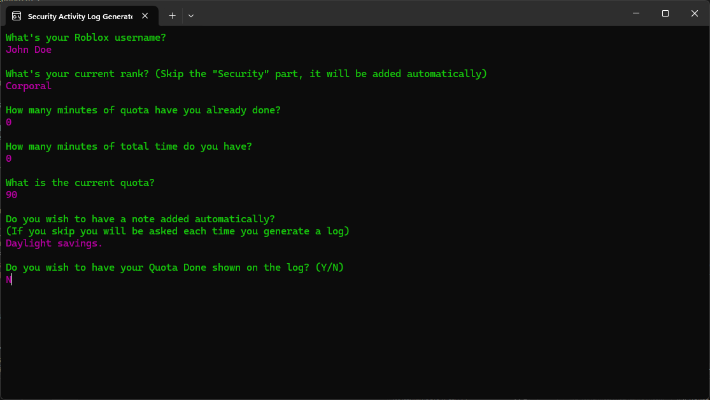
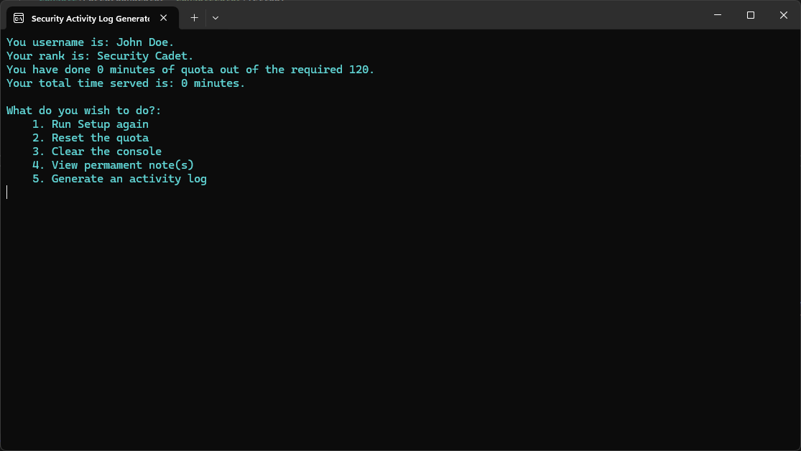
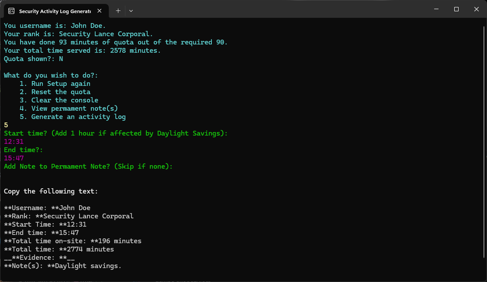

# Security Activity Log Generator (SALG for short)
is a tool for all my fellow **DoS officers** which includes the following:
  - Quota and Total Time management,
  - Total Time on-site calculator, ***(You still have to add that 1 hour if affected by DS)***
  - Permament Notes, *(Notes that appear every time you make a log)*
  - Activity Log Generator, *(Kind of the main thing)*
  - Quota Hiding
  - Skip-to-keep *(Skip whilst doing Setup again to keep a value the way it was)* 

## Usage

### IT IS HIGHLY RECOMMENDED TO PUT THE APP IN A FOLDER

### Setup

Upon the first launch of the application *(Or if it has been fired from the Main Menu)*, the app will ask you for the following:
  1. Your Roblox Username,
  2. Your Rank, ***(You can use shortcuts e.g. "PVT", "ADoS"; It's case in-sensitive; Defaults to Cadet if you misspell)***
  3. Minutes of the Quota done,
  4. Your Total Time,
  5. The Current Quota
  6. Permament Note
  7. Whether you want your Quota Done shown *(So you NCO+ can hide your quota from those pesky EP)*

*After that, an extensionless file called "data" and "notes" **(If Permament Note was specified)** will be created.*

*These files store your data. Do NOT delete them **(Unless you wish to delete all of your data that is)***

### Main Menu

This the section from which you'll basically control everything.

In here, you can:
  1. Run Setup again
  2. Reset your Quota
  3. Clear the Console
  4. View your Permament Note
  5. Generate an Activity Log *(Kind of what you're all about)*

### Generating Activity Logs

The process itself is quite simple.

You will only be asked for a **Start Time**, an **End Time** and some additional notes, if you'd like *(They go after your Permament Note; Separated by a space)*

After that, the app does the rest ***(And you can finally paste that log onto the discord)***.

If your `Quota shown` is set to`Y`, SALG will just add `-# Quota: {Quota Done} / {Quota}` before the `Evidence` part.

*(I highly recommend to keep this on `Y` to save HR some time **[Unless you're NCO+ that is]**)*

## Contact
If you encounter any bugs, errors of any type, or just want to suggest something,
be sure to contact me.

### Discord Username: *tosososoks78*
